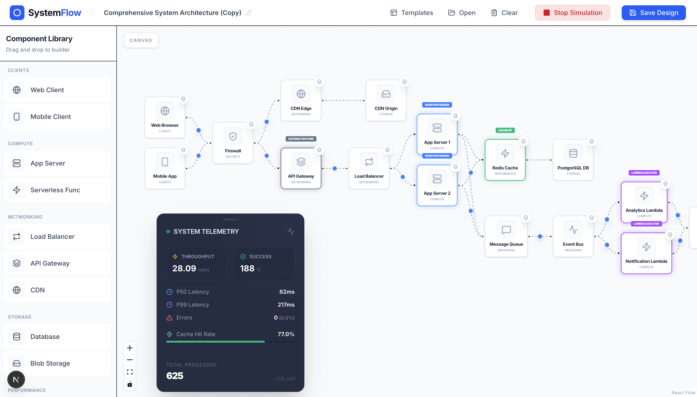
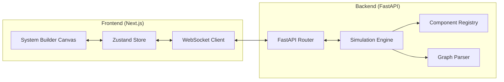

# SDApp: Visual System Design Simulator

SDApp is a powerful, interactive tool designed to help developers and system architects visualize, design, and simulate complex system architectures. Whether you're planning a high-traffic web application or learning about distributed systems, SDApp provides a hands-on environment to test your designs.



## 🚀 Key Features

- **Visual Architecture Builder**: Drag-and-drop interface powered by [React Flow](https://reactflow.dev/) to design system topologies.
- **Real-time Simulation**: A custom Python-based simulation engine that models request flows, latency, and component behavior.
- **Dynamic Component Library**: Support for Load Balancers, Caches, Databases, Clients, and more.
- **Template System**: Load predefined industry-standard architectures (e.g., Netflix, Twitter) as starting points.
- **Analytics & Visualization**: Visual feedback on request flows, cache hits/misses, and system health.

## 🏗️ Architecture

SDApp follows a decoupled client-server architecture:



## 🛠️ Tech Stack

- **Frontend**: [Next.js](https://nextjs.org/), [React Flow](https://xyflow.com/), [Zustand](https://zustand-demo.pmnd.rs/), [Tailwind CSS](https://tailwindcss.com/).
- **Backend**: [FastAPI](https://fastapi.tiangolo.com/), [SimPy](https://simpy.readthedocs.io/) (for simulation logic), [Python 3.10+](https://www.python.org/).
- **Communication**: WebSockets for real-time simulation updates.

## 🚦 Getting Started

### Prerequisites

- [Node.js](https://nodejs.org/) (v18 or later)
- [Python](https://www.python.org/) (v3.10 or later)

### Quick Start

1. **Clone the repository**:
   ```bash
   git clone https://github.com/yourusername/SDApp.git
   cd SDApp
   ```

2. **Setup Backend**:
   ```bash
   cd backend
   # Refer to backend/README.md for detailed setup
   python -m venv venv
   source venv/bin/activate  # On Windows: venv\Scripts\activate
   pip install -r requirements.txt
   uvicorn main:app --reload
   ```

3. **Setup Frontend**:
   ```bash
   cd ../frontend
   # Refer to frontend/README.md for detailed setup
   npm install
   npm run dev
   ```

4. **Open the browser**:
   Navigate to [http://localhost:3000](http://localhost:3000) to start building!

## 📂 Project Structure

- `frontend/`: The Next.js application for the visual builder.
- `backend/`: The FastAPI server and simulation engine logic.
- `application_design_details/`: Detailed design documents and implementation notes.

## 📝 License

This project is licensed under the MIT License - see the [LICENSE](LICENSE) file for details.
